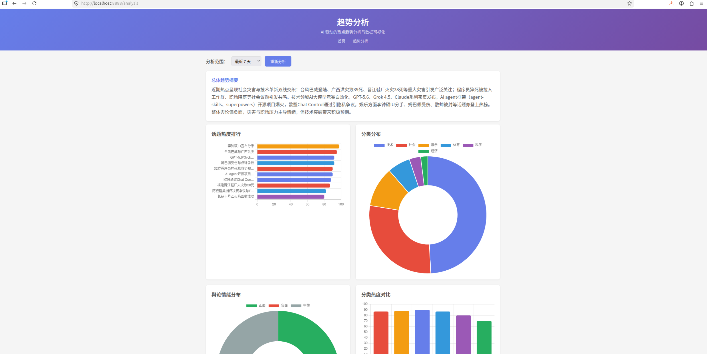
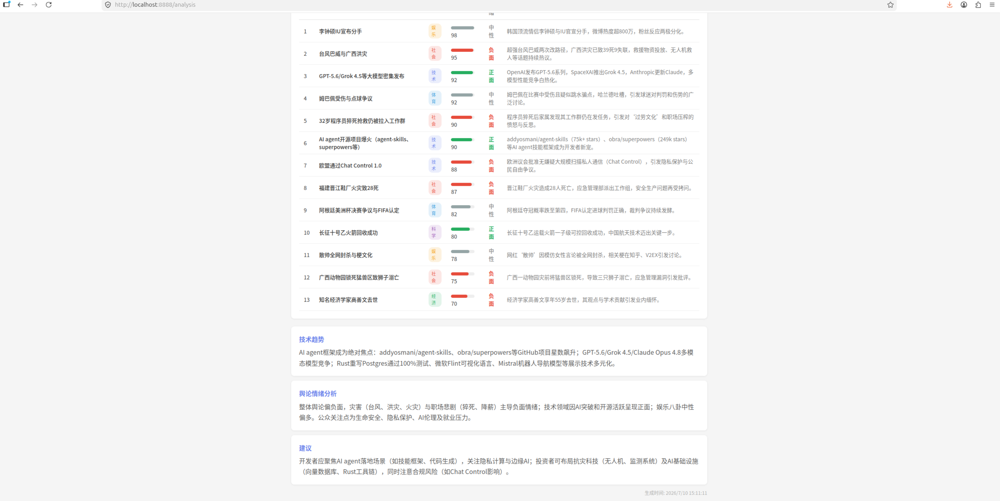
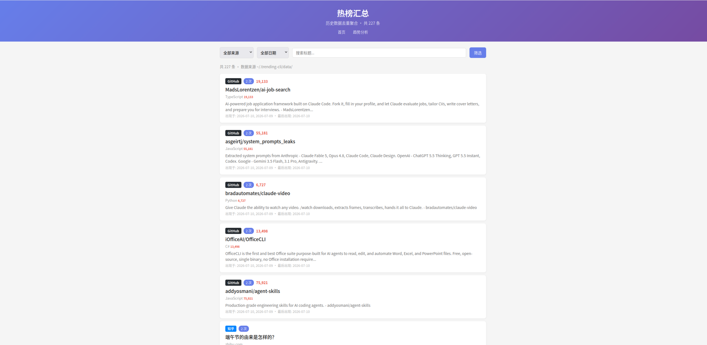

<div align="center">

# 热榜聚合器

**AI 驱动的全网热点趋势分析终端 - 6 源聚合 · 自动存储 · AI 深度分析 · 可视化图表**

GitHub · Reddit · 知乎 · HackerNews · V2EX · 微博

</div>

---

## 快速开始

**前置要求**：安装 [Go 1.21+](https://go.dev/doc/install)

```bash
git clone https://github.com/jcaimumu-arch/trending-cli.git
cd trending-cli
go build -o trending
./trending          # 抓取热榜 + 自动存储
./trending --web    # 启动 Web 界面查看历史数据
./trending --analyze 7  # AI 分析最近 7 天趋势
```

## 核心功能

### 1. AI 趋势分析

配好 API Key 后，一键分析近 N 天的热点趋势：

```bash
# 命令行模式
trending --analyze 7
```

**或通过 Web 界面（推荐）**：

```bash
trending --web
# 浏览器打开 http://localhost:8888/analysis
```

AI 会从 5 个维度分析并生成可视化图表：

| 维度 | 说明 | 图表 |
|------|------|------|
| **总体趋势摘要** | 概括近期热点全貌 | 文字 |
| **热点话题排行** | 8-15 个话题，含分类/热度分数/情绪/一句话描述 | 横向柱状图 + 详情表 |
| **分类分布** | 技术/社会/娱乐/经济/体育/科学/其他 | 环形图 |
| **舆论情绪分布** | 正面/负面/中性占比 | 环形图 |
| **分类热度对比** | 各分类平均热度分数 | 柱状图 |

**Web 趋势分析页面**：



**热点话题详情表**：



**命令行 AI 分析输出**：



**命令行 AI 分析输出示例**：

```
════════════════════════════════════════════════════════════
  AI 趋势分析 · 最近 2 天
════════════════════════════════════════════════════════════

【总体趋势摘要】
近期热点聚焦于自然灾害（台风巴威、广西洪灾）、体育赛事、
AI技术大爆发（GPT-5.6、Grok 4.5、AI Agent框架）以及社会事件。
舆论情绪以中性偏负为主，技术圈活跃。

【热点话题】
  1. [社会] 台风巴威 (热度:90, 负面)
     台风巴威路径多变，可能正面登陆，多地暴雨，引发防灾关注。
  2. [技术] GPT-5.6/Grok 4.5发布 (热度:88, 正面)
     OpenAI和xAI相继发布新模型，多项AI Agent工具同步更新。
  3. [社会] 程序员猝死被拉入工作群 (热度:80, 负面)
     32岁程序员猝死抢救中仍被拉入工作群，引发职场文化讨论。
  ...

【分类分布】
  技术: 4  社会: 3  娱乐: 2  体育: 1  科学: 1

【情绪分布】
  正面: 3  负面: 4  中性: 4

【技术趋势】
AI agent框架成为绝对焦点：agent-skills、superpowers等GitHub
项目星数飙升；GPT-5.6/Grok 4.5多模态模型竞争...

【舆论情绪分析】
整体舆论偏负面，灾害与职场悲剧主导负面情绪；
技术领域因AI突破和开源活跃呈现正面。

【建议】
开发者应聚焦AI agent落地场景，关注隐私计算与边缘AI；
投资者可布局抗灾科技及AI基础设施。

════════════════════════════════════════════════════════════
```

### 配置 AI API Key

支持 **DeepSeek**（默认，国内速度快）和 **Google Gemini**。

创建 `~/.trending-cli/config.json`：

```json
{
  "provider": "deepseek",
  "deepseek_api_key": "sk-你的key",
  "model": "deepseek-v4-flash"
}
```

或使用环境变量：

```bash
export DEEPSEEK_API_KEY="sk-你的key"
# 或
export GEMINI_API_KEY="你的key"
```

| Provider | 配置字段 | 环境变量 | 获取地址 |
|----------|---------|---------|---------|
| **DeepSeek**（默认） | `deepseek_api_key` | `DEEPSEEK_API_KEY` | [platform.deepseek.com](https://platform.deepseek.com/) |
| **Gemini** | `gemini_api_key` | `GEMINI_API_KEY` | [aistudio.google.com](https://aistudio.google.com/apikey) |

切换 provider 只需改 `"provider"` 字段。如果只配了一个 key，程序会自动选择。

### 2. Web 历史数据浏览

```bash
trending --web              # 启动 Web 服务（默认 :8888）
trending --web --addr :9999 # 指定端口
```

- **首页**：历史数据去重聚合，按来源/日期/标题筛选，点击标题跳转原文
- **趋势分析页**（`/analysis`）：AI 分析 + 可视化图表

### 3. 终端热榜聚合

```bash
trending          # 直接在终端看双列面板布局的热榜
```

- 6 源并发抓取，圆角边框双列面板
- OSC8 超链接（Ctrl/Cmd+click 打开）
- 中文宽度对齐（go-runewidth）
- 自动代理探测（Clash 用户零配置直连海外站点）

### 4. 本地存储 + 定时执行

每次运行自动将热榜数据（含正文摘要）存到本地，可配置 systemd timer 每 6 小时自动抓取：

```bash
trending          # 默认就会存储
```

数据存在 `~/.trending-cli/data/`，按天 JSON 文件，AI 分析直接读这些数据。

---

## 数据源

| 源 | 图标 | 说明 |
|----|------|------|
| **GitHub Trending** | `[star]` | 今日热门仓库，含星数和语言 |
| **Reddit** | `[R]` | r/popular 全球热帖 |
| **知乎** | `[Zh]` | 知乎发现页热门问题 |
| **Hacker News** | `[HN]` | Firebase 公开 API，硅谷极客头条 |
| **V2EX** | `[V]` | 中文技术社区热门主题 |
| **微博** | `[Wb]` | 实时热搜榜 |

全部零 Key、零认证、纯公开接口。

## 界面预览

```
╔════════════════════════════════════════════════════════════════════════╗
║                                                                        ║
║  [Net] 热榜聚合    70 条 · 19:30                                        ║
║                                                                        ║
║  ╭──────────────────────────────────────────╮  ╭──────────────────────╮ ║
║  │ [star] GitHub                            │  │ [HN] HackerNews      │ ║
║  │                                          │  │                      │ ║
║  │ 1  user/repo                  ★ 1.2k     │  │ 1  Title       369   │ ║
║  │ 2  another/repo               ★ 800       │  │ 2  Title       549   │ ║
║  │ ...                                      │  │ ...                  │ ║
║  ╰──────────────────────────────────────────╯  ╰──────────────────────╯ ║
║                                                                        ║
╚════════════════════════════════════════════════════════════════════════╝
```

## 命令行参数

```bash
trending                              # 抓取热榜 + 自动存储（默认）
trending --version                    # 查看版本号
trending --save=false                 # 只看不存
trending --proxy http://127.0.0.1:7897  # 手动指定代理
trending --proxy socks5://127.0.0.1:1080  # SOCKS5 代理
trending --timeout 60                 # 调整请求超时秒数
trending --web                        # 启动 Web 界面
trending --web --addr :9999           # 指定 Web 端口
trending --analyze 7                 # AI 分析最近 7 天趋势
```

### 代理支持

| 优先级 | 方式 |
|--------|------|
| 1 | `--proxy` 命令行参数 |
| 2 | `HTTP_PROXY` / `HTTPS_PROXY` / `ALL_PROXY` 环境变量 |
| 3 | **自动探测本地 Clash 代理**（7897/7890/7891） |
| 4 | 直连 |

Clash 开着就自动用，没开就直连，零配置。

## 本地存储

### 存储路径

```
~/.trending-cli/
├── config.json          # AI 配置
└── data/
    ├── 2026-07-09.json   # 按日期存储
    ├── 2026-07-10.json
    └── ...
```

### 每条记录

```json
{
  "id": "b93dd9dda6a3c8fb",
  "source": "GitHub",
  "title": "addyosmani/agent-skills",
  "url": "https://github.com/addyosmani/agent-skills",
  "desc": "Production-grade engineering skills for AI coding agents.",
  "heat": "74,256",
  "content": "正文摘要（最多 500 字符）...",
  "fetched_at": "2026-07-09T10:24:45+08:00"
}
```

### 正文摘要抓取

每条条目并发抓取正文（限并发 10）：优先 `meta description`，其次 `<article>/<p>` 段落，噪音检测后截断 500 字。

### 去重策略

- **按天去重**：同一天多次运行只存新增
- **跨天不拦截**：每天完整快照，便于追踪热度变化

## 定时执行（systemd timer）

```bash
# 编译并放到 PATH
go build -o trending .
cp trending ~/.local/bin/

# 创建 systemd 用户服务
mkdir -p ~/.config/systemd/user

cat > ~/.config/systemd/user/trending.service << 'EOF'
[Unit]
Description=Trending CLI - 抓取热榜并存储到本地
[Service]
Type=oneshot
ExecStart=%h/.local/bin/trending --save
StandardOutput=append:%h/.trending-cli/data/trending.log
StandardError=append:%h/.trending-cli/data/trending.log
EOF

cat > ~/.config/systemd/user/trending.timer << 'EOF'
[Unit]
Description=定时运行 trending 热榜抓取
[Timer]
OnCalendar=*-*-* 00/6:00:00
Persistent=true
[Install]
WantedBy=default.target
EOF

systemctl --user daemon-reload
systemctl --user enable trending.timer
systemctl --user start trending.timer
loginctl enable-linger $USER
```

修改间隔：编辑 `trending.timer` 的 `OnCalendar` 行，`daemon-reload` 生效。

## 项目结构

```
trending-cli/
├── fetch.go        # 数据模型 + HTTP 客户端 + 6 源抓取 + 代理探测
├── render.go       # 终端渲染 + 程序入口 main()
├── store.go        # 本地存储（正文抓取 / 按天去重 / JSON 存储）
├── ai.go           # AI 分析（DeepSeek/Gemini 双 provider + 趋势分析）
├── web.go          # Web 服务（历史数据浏览 + AI 分析图表页面）
├── go.mod
├── go.sum
└── README.md
```

## 技术栈

| 用途 | 依赖 |
|------|------|
| 网络请求 | `net/http`（标准库，goroutine 并发） |
| 代理支持 | HTTP/HTTPS（`http.Transport.Proxy`）+ SOCKS5（`golang.org/x/net/proxy`） |
| HTML 解析 | `github.com/PuerkitoBio/goquery` |
| 终端渲染 | 手动 ANSI + `github.com/charmbracelet/lipgloss` |
| 宽度对齐 | `github.com/mattn/go-runewidth` |
| AI 分析 | DeepSeek API / Google Gemini API |
| 图表 | Chart.js 4.4（CDN） |
| 本地存储 | 标准库 `encoding/json` + `os` |

## 构建

```bash
go build -o trending

# 交叉编译
GOOS=darwin  GOARCH=arm64 go build -o trending-darwin   # macOS Apple Silicon
GOOS=linux   GOARCH=amd64 go build -o trending-linux    # Linux x86_64
GOOS=windows GOARCH=amd64 go build -o trending.exe      # Windows
```

## 免责声明

本工具仅供学习交流，所有数据来自各大平台公开接口，请合理使用。
